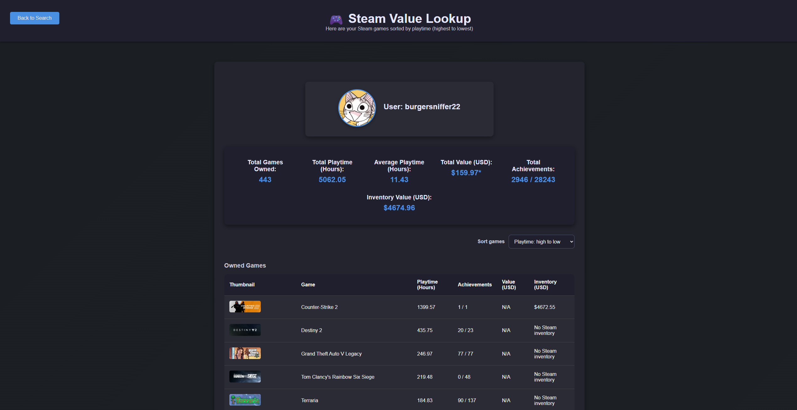

# Steam Value Lookup

<p align="center">
  <a href="https://github.com/quangshuynh/steam-value-lookup/actions/workflows/tests.yml"></a>
  
  <a href="./LICENSE"></a>
</p>

Steam Value Lookup is a Flask web application that analyzes a Steam user's game library and estimates its current total store value. Enter a numeric SteamID or Steam vanity name to view profile information, owned games, playtime statistics, and per-game prices.

<p align="center">
  
</p>

<p align="center">
  <em>Steam library analysis showing game values and aggregate library statistics</em>
</p>

## Features

- Accepts a 17-digit SteamID or a Steam vanity name.
- Loads the user's public Steam profile and owned games.
- Fetches current US store prices from Steam's Store API.
- Calculates total games, total playtime, average playtime, and estimated library value.
- Loads achievement totals and supported public inventory values.
- Sorts games by playtime, name, or store value.
- Links profiles, game thumbnails, and games back to Steam.
- Initializes a local SQLite database and SQLAlchemy models for application data.

## How It Works

1. The app resolves a vanity name to a SteamID when necessary.
2. Steam's Web API returns the user's profile and owned games.
3. Store prices are requested concurrently for the returned app IDs.
4. Achievement data is requested for games with recorded playtime.
5. Flask renders the results page with calculated library statistics.

Price data is estimated based on current U.S. store prices. Free games are listed as `$0.00`, while unavailable, delisted, or price-hidden games are listed as `N/A`.

## Requirements

- Python 3.10 or newer
- A [Steam Web API key](https://steamcommunity.com/dev/apikey) for Steam profile and library data
- A [SteamWebAPI key](https://www.steamwebapi.com/dashboard) for supported inventory valuation
- A Steam profile with game details visible to the API

## Setup

From the project root:

```bash
python -m venv .venv
```

Activate the virtual environment:

**Windows PowerShell**

```powershell
.venv\Scripts\Activate.ps1
```

**Windows Command Prompt**

```bat
.venv\Scripts\activate
```

Install the dependencies:

```bash
pip install -r requirements.txt
```

The `requirements.txt` file contains the application, HTTP client, database, environment, and test dependencies needed to develop and run the project.

Create a `.env` file in the project root:

```env
STEAM_API_KEY=your_steam_web_api_key
STEAMWEBAPI_KEY=your_steamwebapi_key
DATABASE_URL=sqlite:///steam_value_lookup.db
```

API keys can be obtained from:

- [`STEAM_API_KEY` - Steam Web API](https://steamcommunity.com/dev/apikey)
- [`STEAMWEBAPI_KEY` - SteamWebAPI](https://www.steamwebapi.com/dashboard)

`DATABASE_URL` is optional. If omitted, the app uses SQLite. Do not commit `.env` or expose your API keys.

## Run Locally

The Flask application imports modules from `backend`, so start it from that directory:

```bash
cd backend
python app.py
```

Open [http://127.0.0.1:5000](http://127.0.0.1:5000) in a browser.

The development server runs with Flask debug mode enabled by `app.py`. For production, use a WSGI server and disable debug mode.

## Run Tests

Run the test suite from the `backend` directory so the application modules resolve correctly:

```bash
cd backend
python -m pytest -v
```

The tests cover vanity-name resolution, store pricing and achievement response handling, Flask lookup routes and aggregate calculations, empty libraries, and in-memory SQLAlchemy model initialization. External API calls are blocked or mocked, so tests do not consume Steam or SteamWebAPI quotas and do not require API keys.

## Project Structure

```text
.
|-- backend/
|   |-- app.py                 # Flask routes and lookup workflow
|   |-- config.py              # Environment-based configuration
|   |-- database.py            # SQLAlchemy setup and table initialization
|   |-- models.py              # User, game, and inventory models
|   |-- steam_api.py           # Steam API and valuation helpers
|   |-- static/                # CSS and browser-side sorting logic
|   |-- templates/             # Search and results pages
|   `-- tests/
|       |-- __init__.py
|       |-- conftest.py        # Network-isolation fixture
|       |-- test_app.py        # Flask route and aggregation tests
|       |-- test_database.py   # In-memory SQLAlchemy model tests
|       `-- test_steam_api.py  # Steam API valuation tests
|-- docs/
|   `-- images/                # README screenshots
|-- instance/
|   `-- steam_value_lookup.db  # Local SQLite database
|-- requirements.txt           # Runtime and test dependencies
`-- steam_value_lookup.sql     # Reference SQL schema
```

## Routes

| Method | Route | Purpose |
| --- | --- | --- |
| `GET` | `/` | Displays the SteamID search form |
| `POST` | `/lookup` | Fetches and displays a user's library and estimated values |

## Privacy and API Notes

- Steam profile and game details must be publicly available for the lookup to return useful data.
- Steam API and Store API responses may be rate-limited or temporarily unavailable.
- The app requests prices in US dollars (`cc=us`).
- The current lookup flow does not persist fetched users or games to the database; the models and schema are available for future persistence work.
- Steam owns the Steam trademarks and related content. This project is an independent tool and is not affiliated with Valve.

## Limitations and Future Improvements

- Cache price lookups and add API request timeouts/retry handling for all endpoints.
- Persist lookup results using the existing SQLAlchemy models.
- Add currency selection and clearer handling for private profiles.
- Expand request caching and resilience tests as the external integrations evolve.
